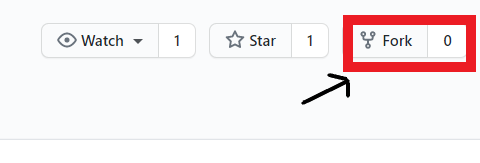
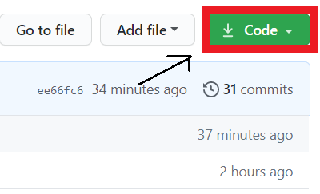
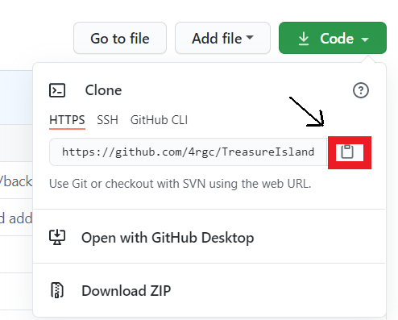

<b>Tresure Island</b>
This is the project for the Aye Aye Hackers Hackathon which was taking place from the 18th to the 20nd of September.
This is a fun and exciting game wherein you have to find the secret treasure. Do you want to try it? Then follow these steps.
Step 1: Install git on your Mac or PC,[install it]( https://help.github.com/articles/set-up-git/).



## Fork this repository
Step 2:
Fork this repository by clicking on the fork button on the top of this page.
This will create a copy of this repository in your account.

## Clone the repository


Step 3:
Now clone the forked repository to your machine. Go to your GitHub account, open the forked repository, click on the code button and then click the *copy to clipboard* icon.
Step 4:
Open a terminal and run the following git command:

```
git clone "url you just copied"
```
where "url you just copied" (without the quotation marks) is the url to this repository (your fork of this project). See the previous steps to obtain the url.



For example:
```
git clone https://github.com/4rgc/TreasureIsland.git
```
Great! Now you have copied the code of TreasureIsland into your computer. Have fun!
